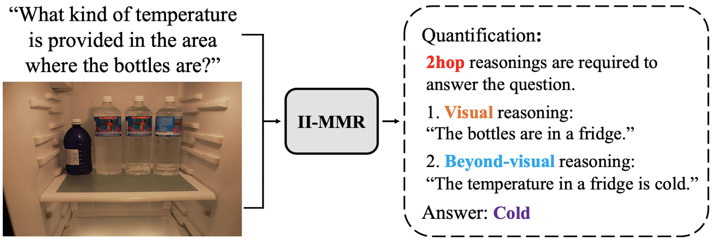

# II-MMR

Official implementation for the paper [II-MMR: Identifying and Improving
Multi-modal Multi-hop Reasoning in Visual Question Answering](https://arxiv.org/abs/2402.11058) by Jihyung Kil, Farideh Tavazoee, Dongyeop Kang, Joo-Kyung Kim, **ACL Findings 2024**.

 

  

 

More updates will be available soon.
